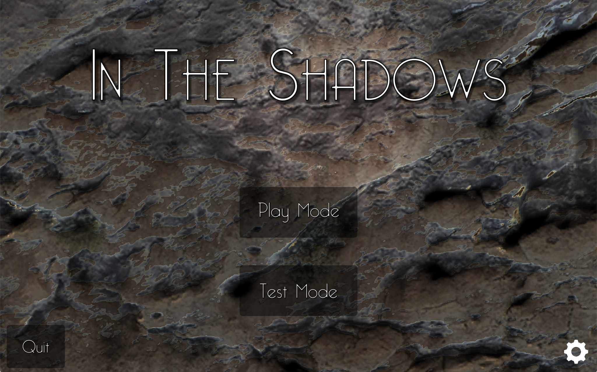
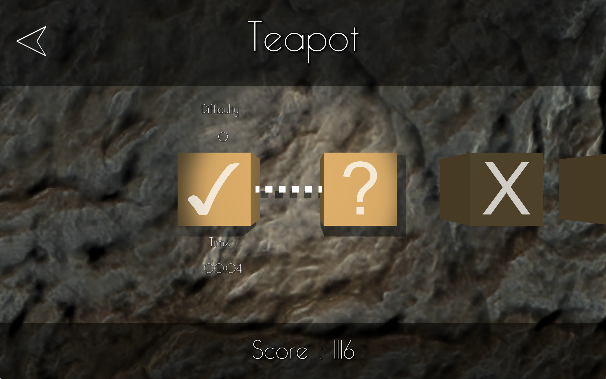
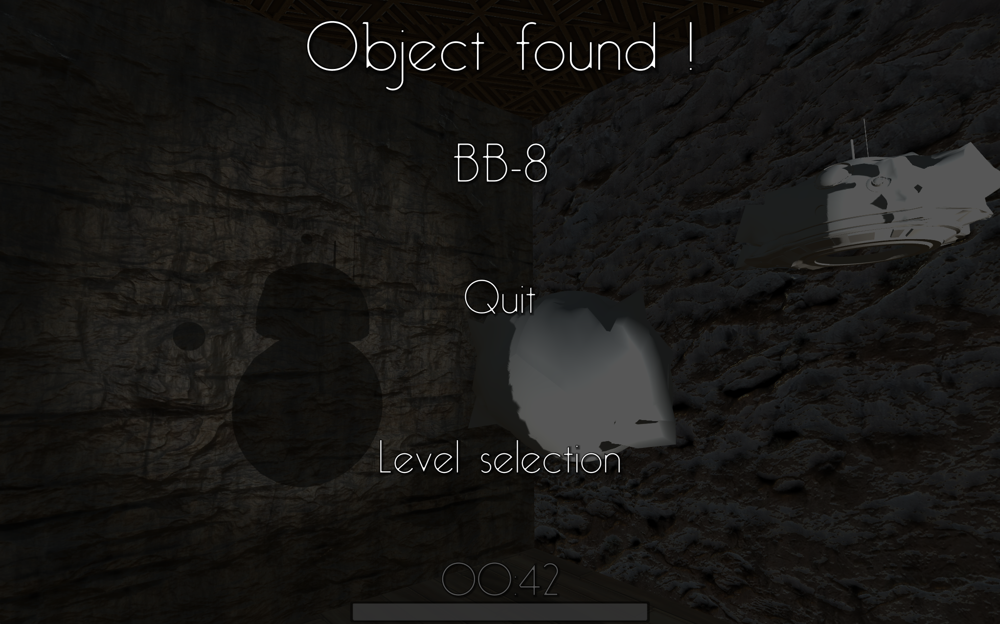

# In-The-Shadow

42 school project: 3D Puzzle game. Single player shadow puppet game. Shadowmatic like

Game developed with **Unity (C#)**.

# Main Menu

### Two play modes:

  1. **Normal** mode:
      - First level unlocked, by finishing a level you unlock the next one
      - Progress saved with level's score and time spent to finish it
  2. **Test** mode (Cheat mode):
      - Unlimited access to all levels
      - Easy access to test each models validations

### Settings window with:
  - Data reseting
  - Audio management
  - Resolution's selector

Data saved on local disk, in json format

# Level selection

### Selector

- Animation when level is unlocked
- Selection animation when a level is choosed
- Level's informations while passing over it : difficulty and score
- Display name of level on the header or a hint if the level is not finished
- Random textures

Status text of corresponding level :
- `X` : Locked
- `?` : Available
- `✓` : Finished

3 levels of difficulty related to mouse movement possibilities.

1.  Horizontal rotation only (Horizontal: Clic + mouse movement)
2.  Horizontal and vertical rotations (Vertical: CTRL + clic + mouse movement)
3.  Horizontal and vertical rotations + object positions (Positions: Shift + clic + mouse movement)

# Level scene

  - Distorted object representing a specific shadow with specific rotation and position
  - Progress bar until desired rotation + position
  - Random textures
  - Basic dust effect
  - Light management. One for the object, another one for level's validation
